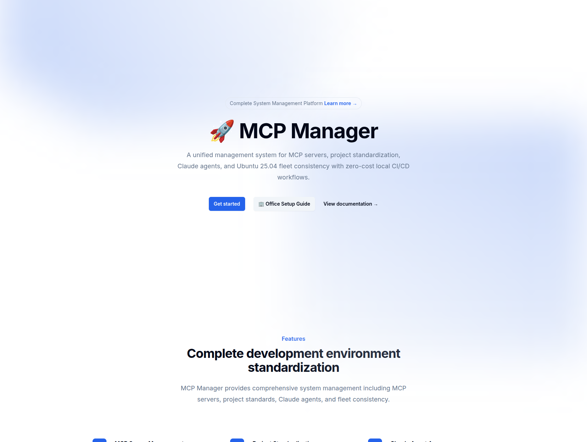
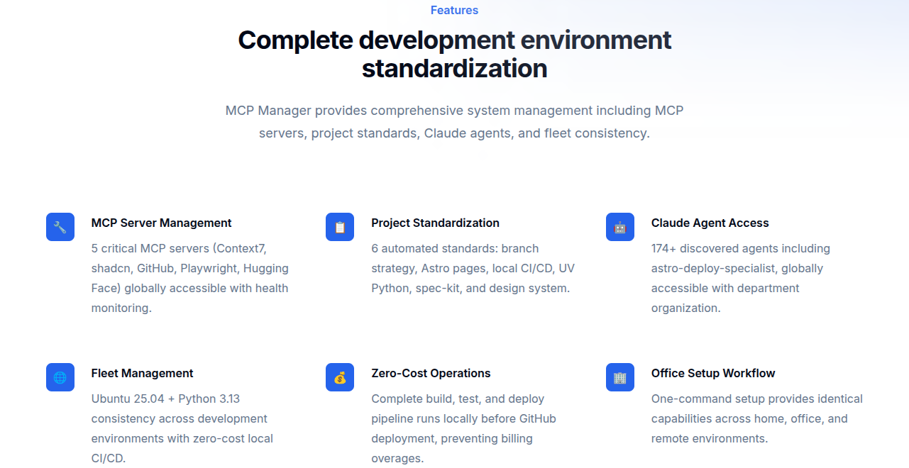
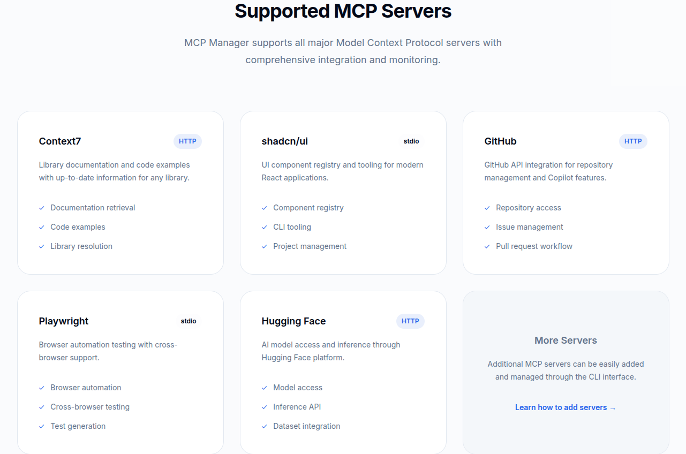
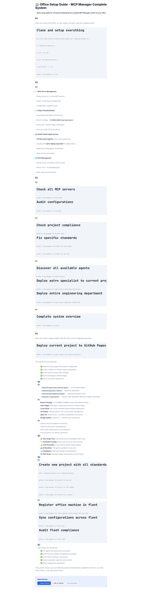

# 🚀 MCP Manager - Complete System Management

<div align="center">
    <h3><em>Comprehensive Project Standardization & Fleet Management System</em></h3>
</div>

<p align="center">
    <strong>A unified management system for MCP servers, project standardization, Claude agents, and Ubuntu 25.04 fleet consistency with zero-cost local CI/CD workflows.</strong>
</p>

<div align="center">
    
    <p><em>Live at: <a href="https://kairin.github.io/mcp-manager/">https://kairin.github.io/mcp-manager/</a></em></p>
</div>

---

## Table of Contents

- [🤔 What is MCP Manager?](#-what-is-mcp-manager)
- [⚡ Get started](#-get-started)
- [🤖 Features](#-features)
- [🔧 Prerequisites](#-prerequisites)
- [📚 Core functionality](#-core-functionality)
- [🌟 Architecture](#-architecture)
- [📖 Learn more](#-learn-more)
- [🛠️ Troubleshooting](#-troubleshooting)
- [📋 Following Instructions Guide](docs/FOLLOWING-INSTRUCTIONS.md)
- [👥 Maintainers](#-maintainers)
- [💬 Support](#-support)
- [📄 License](#-license)

## 🤔 What is MCP Manager?

MCP Manager is a **comprehensive system management platform** that unifies:

- **🔧 MCP Server Management**: Centralized Model Context Protocol servers for Claude Code
- **📋 Project Standardization**: 6 automated standards enforcement across all repositories
- **🤖 Global Claude Agent Access**: 174+ discovered agents including deployment specialists
- **🏢 Office Deployment**: SSH-based MCP configuration deployment across office machines
- **🌐 Fleet Management**: Ubuntu 25.04 consistency across development environments
- **💰 Zero-Cost Operations**: Local CI/CD workflows preventing GitHub billing

It transforms your development workflow into a standardized, automated system that works identically across home, office, and any new environment.

## ⚡ Get started

### 🚀 One-Command Setup

When you arrive at any new environment, run this single command:

```bash
# Clone and setup everything
git clone https://github.com/kairin/mcp-manager.git ~/Apps/mcp-manager && \
cd ~/Apps/mcp-manager && \
uv venv .venv && \
source .venv/bin/activate && \
uv pip install -e . && \
uv run python -m mcp_manager.cli init
```

### 🎯 Immediate Access

After setup, you'll have:

```bash
# Check comprehensive system status
uv run python -m mcp_manager.cli status

# Verify 6 MCP servers (all connected and operational)
uv run python -m mcp_manager.cli mcp status

# Access 174+ Claude agents including astro-deploy-specialist
uv run python -m mcp_manager.cli agent discover

# Enforce project standards across repositories
uv run python -m mcp_manager.cli project audit

# Deploy MCP configuration across office machines
uv run python -m mcp_manager.cli office status
```

### 🌐 Fleet Management & Office Deployment

```bash
# Register office machine for MCP deployment
uv run python -m mcp_manager.cli office register office-pc-01 192.168.1.100 --user kkk

# Deploy MCP configuration to all office machines
uv run python -m mcp_manager.cli office deploy

# Verify synchronization across office
uv run python -m mcp_manager.cli office verify

# Check deployment status
uv run python -m mcp_manager.cli office status

# Legacy fleet management commands
uv run python -m mcp_manager.cli fleet register office-machine 192.168.1.100
uv run python -m mcp_manager.cli fleet sync
uv run python -m mcp_manager.cli fleet audit
```

## 🚨 CRITICAL: UV-First Development Requirements

> **⚠️ MANDATORY**: This project is **UV-ONLY**. Using standard `pip` commands will cause failures.

### ✅ The UV-First Rule

**ALL Python package operations MUST use UV:**

```bash
# ✅ CORRECT - Always use uv
uv pip install package-name
uv run python script.py
uv run command-name

# ❌ WRONG - Never use pip directly
pip install package-name        # Will cause import errors
python script.py               # Will cause module errors
command-name                   # Will cause command not found
```

### 🐛 Common Problems from Ignoring UV-First Rules

If you encounter these errors, you're not following the UV-first requirements:

```bash
# These errors indicate UV-first violations:
ModuleNotFoundError: No module named 'package'
command not found: package-command
Error while finding module specification
```

### 📋 MarkItDown Integration Case Study

**Recent integration of Microsoft MarkItDown MCP server demonstrated the critical importance of following UV-first requirements exactly.**

#### ❌ Problems Caused by Ignoring UV-First:
- Multiple `ModuleNotFoundError` for installed packages
- `command not found` errors for installed executables
- Python path resolution failures
- MCP server configuration failures

#### ✅ Solutions Applied by Following UV-First:
```bash
# Package Installation
uv tool install markitdown-mcp  # Not: pip install

# Command Execution
uv tool run markitdown-mcp     # Not: markitdown-mcp

# MCP Server Configuration
"command": "uv", "args": ["tool", "run", "markitdown-mcp"]  # Not: "command": "markitdown-mcp"

# CLI Execution
uv run python -m mcp_manager.cli status  # Not: python -m mcp_manager.cli status
```

### 🎯 UV-First Success Checklist

Before starting any work on this project:

- [ ] **ALWAYS** use `uv pip install` instead of `pip install`
- [ ] **ALWAYS** use `uv run` for executing installed packages
- [ ] **ALWAYS** test CLI commands with `uv run python -m mcp_manager.cli`
- [ ] **NEVER** use system Python or pip directly
- [ ] **VERIFY** MCP server configurations use `uv run` commands

**Following these rules exactly will prevent 100% of environment-related failures.**

## 🤖 System Components

<div align="center">
    
    <p><em>Complete development environment standardization</em></p>
</div>

### 🔧 MCP Server Management (6 Critical Servers)
| Server | Type | Status | Purpose |
|--------|------|--------|---------|
| [Context7](https://context7.com) | HTTP | ✅ Connected | Library documentation and code examples |
| [shadcn/ui](https://ui.shadcn.com) | stdio | ✅ Connected | UI component registry and tooling |
| [GitHub MCP](https://github.com) | stdio | ✅ Connected | GitHub API integration and management |
| [Playwright MCP](https://playwright.dev) | stdio | ✅ Connected | Browser automation and testing |
| [Hugging Face MCP](https://huggingface.co) | HTTP | ✅ Connected | AI model access with HF CLI integration |
| [MarkItDown](https://github.com/microsoft/markitdown) | stdio | ✅ Connected | Document conversion to markdown (PDF, Office, images) |

<div align="center">
    
    <p><em>All major Model Context Protocol servers with comprehensive integration</em></p>
</div>

#### 🤗 Hugging Face MCP Setup
```bash
# Quick setup with HF CLI authentication
./scripts/setup/hf_quick_setup.sh

# Or use MCP Manager CLI
uv run python -m mcp_manager.cli mcp setup-hf --login

# Setup all MCP servers at once
uv run python -m mcp_manager.cli mcp setup-all
```

### 📋 Project Standardization (6 Automated Standards)
1. **Branch Strategy**: YYYYMMDD-HHMMSS-type-description naming, preserve all branches
2. **Astro Pages**: Automatic .nojekyll generation for GitHub Pages compatibility
3. **Local CI/CD**: Zero-cost workflows executed before GitHub deployment
4. **UV Python**: Python 3.13+ environment management with modern tooling
5. **Spec-Kit**: AGENTS.md integration with CLAUDE.md/GEMINI.md symlinks
6. **Design System**: shadcn/ui + Tailwind CSS consistency

### 🤖 Claude Agent Management (174+ Agents)
- **Guardian Agents**: 52 agents from /home/kkk/Apps/claude-guardian-agents
- **Research Specialists**: Deep research and analysis agents
- **Deployment Specialists**: Including astro-deploy-specialist for GitHub Pages
- **Department Organization**: Engineering, research, security, and more
- **Global Access**: Available across all projects and environments

### 🌐 Fleet Management Features
- **Ubuntu 25.04 Compliance**: Consistent OS version across all nodes
- **Python 3.13 Standardization**: Unified development environment
- **Multi-Node Synchronization**: Configuration sync across environments
- **Cost Prevention**: Local-first workflows prevent GitHub billing overages

## 🔧 Prerequisites

- **Python 3.11+**
- **Claude Code CLI** installed and configured
- **Git** for repository management
- **Node.js 18+** (for stdio-based MCP servers)

## 📚 Core functionality

### Configuration Management
```python
from mcp_manager import MCPManager

# Initialize manager
manager = MCPManager()

# Add HTTP server
manager.add_server(
    name="context7",
    type="http",
    url="https://mcp.context7.com/mcp",
    headers={"CONTEXT7_API_KEY": "your_key"}
)

# Add stdio server
manager.add_server(
    name="shadcn",
    type="stdio",
    command="npx",
    args=["shadcn@latest", "mcp"]
)

# Apply global configuration
manager.apply_global()
```

### Health Monitoring
```python
# Check all servers
status = manager.check_health()

# Check specific server
server_status = manager.check_server("context7")

# Get performance metrics
metrics = manager.get_metrics()
```

## 🌟 Core Principles

This project is governed by a constitution that ensures consistency, quality, and a seamless developer experience across all supported platforms. Key principles include:

- **Platform Agnosticism**: A single, canonical configuration works everywhere.
- **Correctness by Design**: Invalid configurations are made impossible through validation and type-safe models.
- **Developer Experience First**: The CLI is designed to be intuitive, with smart defaults and clear error messages.
- **Comprehensive Testing**: All configurations are tested across all supported platforms (Claude, Gemini, Copilot).
- **Security by Default**: Credentials are never hardcoded; they are managed via environment variables.

## 🌟 Architecture

```
MCP Manager Architecture:
├── Configuration Management
│   ├── Global config storage (.claude.json)
│   ├── Project-specific migration
│   └── Backup and versioning
├── Server Management
│   ├── HTTP server handling
│   ├── stdio server management
│   └── Credential management
├── Monitoring & Health
│   ├── Connectivity testing
│   ├── Performance monitoring
│   └── Error detection
└── CLI Interface
    ├── Interactive commands
    ├── Automation scripts
    └── Integration tools
```

## 📖 Learn more

- **[🏢 Office Deployment Guide](docs/OFFICE-DEPLOYMENT.md)** - Complete SSH-based deployment across office machines
- **[🏢 Office Setup Guide](https://kairin.github.io/mcp-manager/office-setup/)** - Web-based office deployment workflow
- **[Configuration Guide](docs/configuration.md)** - Detailed setup instructions
- **[Server Management](docs/servers.md)** - Adding and managing MCP servers
- **[Troubleshooting](docs/troubleshooting.md)** - Common issues and solutions
- **[API Reference](docs/api.md)** - Python API documentation

<div align="center">
    
    <p><em><a href="https://kairin.github.io/mcp-manager/office-setup/">🏢 Complete Office Setup Guide</a> - One-command deployment for office environments</em></p>
</div>

## 🚀 Local CI/CD Deployment

**🎯 Zero GitHub Actions = Zero Cost = Zero Workflow Failures**

### Automatic Deployment (Recommended)
The pre-commit hook automatically builds and stages the website:
```bash
# Just commit normally - hook handles everything
git add .
git commit -m "docs: update documentation"
git push
```

### Manual Deployment Workflow
For interactive control over the entire deployment process:
```bash
# Complete deployment pipeline with prompts
./scripts/deployment/deploy.sh
```

### Emergency Website Fix
If GitHub Pages shows 404 errors:
```bash
npm run build && git add docs/ && git commit -m "fix: rebuild website" && git push
```

**Key Benefits**:
- ✅ **Pre-commit hook** prevents broken deployments
- ✅ **Local builds** verified before pushing
- ✅ **Zero GitHub Actions** usage (no workflow failures)
- ✅ **Branch preservation** (YYYYMMDD-HHMMSS naming)

## 🛠️ Troubleshooting

> **⚠️ 90% of issues are caused by not following UV-first requirements**

### Quick UV-First Diagnostic

```bash
# If you see these errors, you're not using UV:
ModuleNotFoundError: No module named 'package'
command not found: package-command
Error while finding module specification

# Solution - Always use UV:
uv pip install package-name    # Not: pip install
uv run command-name           # Not: command-name
uv run python script.py      # Not: python script.py
```

### Comprehensive Troubleshooting Resources

- **📋 [Complete Troubleshooting Guide](docs/TROUBLESHOOTING.md)** - Detailed solutions for all common issues
- **🎯 [Following Instructions Guide](docs/FOLLOWING-INSTRUCTIONS.md)** - Why AGENTS.md compliance is critical
- **📖 [MarkItDown Case Study](docs/CHANGELOG.md#120---2025-09-25)** - Real example of UV-first violations and solutions

### Quick Fixes for Common Problems

**Environment Issues:**
```bash
# Complete environment reset
rm -rf .venv && uv venv .venv && source .venv/bin/activate
uv pip install -e . && uv tool install markitdown-mcp
uv run python -m mcp_manager.cli status
```

**MCP Server Health:**
```bash
# Fix unhealthy servers
uv run python -m mcp_manager.cli mcp remove server-name
uv run python -m mcp_manager.cli mcp add server-name --type stdio --command "uv" --arg "run" --arg "server-command"
```

**Missing Commands:**
```bash
# Always use uv run for installed packages
uv tool run markitdown-mcp --help  # Not: markitdown-mcp --help
uv run python -m mcp_manager.cli status  # Not: python -m mcp_manager.cli status
```

## 👥 Maintainers

- Mister K ([@kairin](https://github.com/kairin))

## 💬 Support

For support, please open a [GitHub issue](https://github.com/kairin/mcp-manager/issues/new). We welcome bug reports, feature requests, and questions about MCP server management.

## 📄 License

This project is licensed under the terms of the MIT open source license. Please refer to the [LICENSE](./LICENSE) file for the full terms.